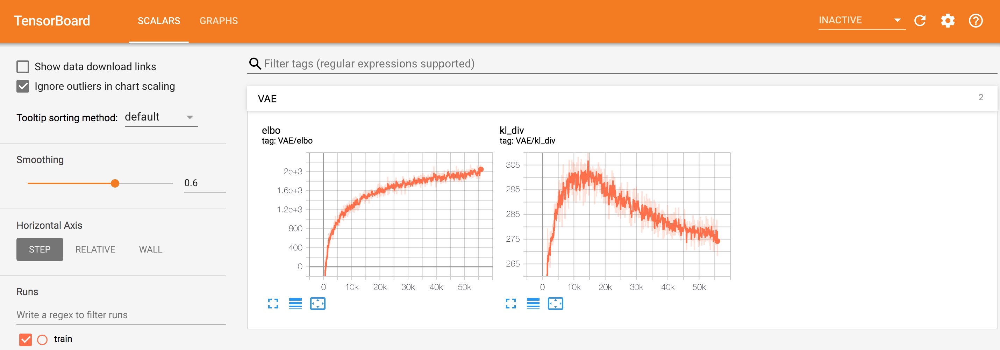

# tfp_vae
Variational Autoencoder using Tensorflow Probability library


## Dependencies
```
tensorflow==1.13.1
tensorflow_probability==0.6.0
tensorflow_datasets==1.0.2
numpy==1.16.4
matplotlib==3.1.0
moviepy==1.0.0
```

## Datasets

This implementation uses the Tensorflow Datasets library, and includes out-of-the-box support for MNIST, CelebA, CIFAR-10, and Omniglot. 
While our preprocessing pipeline has only been tested on those datasets, in most cases, support for additional datasets can be added easily. 
If you'd like support to be extended to any additional datasets contained in the Tensorflow Datasets library, feel free to open an issue.  

## Usage

To train a VAE on MNIST, you can run:

    $ python app.py --dataset=mnist --img_height=32 --img_width=32 --img_channels=1 --z_dim=100 --mode=train

For a full list of options, including options for checkpointing, tensorboard, and creating visualizations,
you can run:

    $ python app.py --help


## Tensorboard
To visualize results using Tensorboard, you can open a second shell, and run:

    $ tensorboard --logdir=/tmp/vae_summaries/ --host=localhost

where `logdir` should be the directory you specified using the `summaries_dir` flag. 

Now you can open a browser, and navigate to `localhost:6006`, and you'll be able to monitor training progress:

